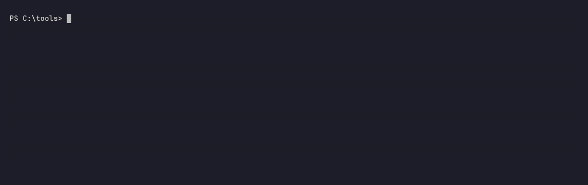
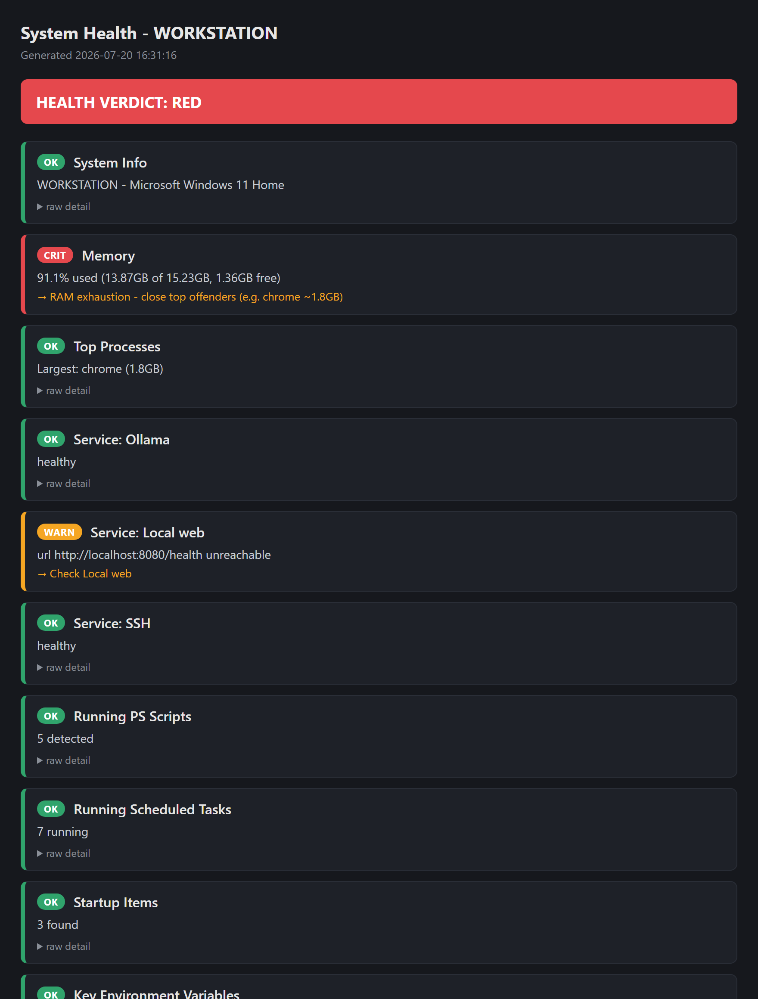
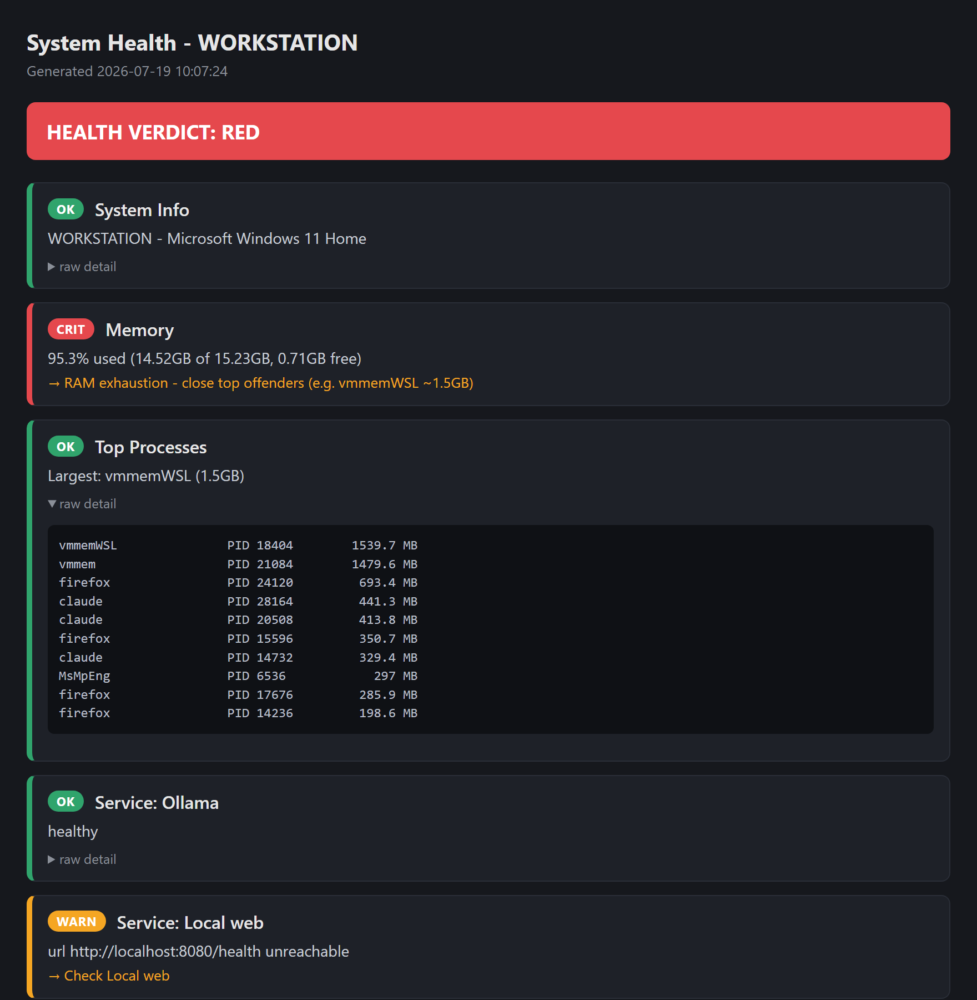

# Pickle Diagnostics Toolkit

Windows system & network diagnostics with a shared color-coded verdict + HTML report layer.
Runs a battery of checks, judges them (GREEN / YELLOW / RED), tells you *only the problems*
and how to fix them, and writes a scannable HTML report.





> **Platform: Windows only.** These scripts rely on Windows-specific facilities
> (CIM/WMI, `Get-NetTCPConnection`, `Get-ScheduledTask`, `Get-WinEvent`, `netsh`, `powercfg`).
> PowerShell 7+ recommended; the shared report engine is portable, but the collectors are not.

## Scripts

| File | Purpose |
|------|---------|
| `Toolkit.ps1` | Menu launcher - pick a check or open the last report. |
| `diagnostic.ps1` | System health: RAM pressure, top-memory processes, configurable service checks. Read-only. |
| `Network_Cockpit_Danger.ps1` | Network diagnostics: baseline sweep, ping/tracert, repairs, Wi-Fi, monitoring. |
| `HealthReport.ps1` | Shared engine: `Add-Finding` / verdict / text / HTML / JSON / exit-code. |

## Usage

```powershell
# Menu:
powershell -File .\Toolkit.ps1

# System check (human):
powershell -File .\diagnostic.ps1

# Automation-friendly: JSON to stdout, no browser popup, severity exit code:
powershell -File .\diagnostic.ps1 -Json -Quiet

# Network - safe (read-only) vs full danger mode:
powershell -File .\Network_Cockpit_Danger.ps1
powershell -File .\Network_Cockpit_Danger.ps1 -DangerMode

# Preview the destructive repairs without running them:
powershell -File .\Network_Cockpit_Danger.ps1 -DangerMode -WhatIf
```

**Flags:** `-Json` (machine-readable output), `-Quiet` (don't auto-open the HTML),
`-Explain` (AI plain-English root-cause + fixes, see below), `-WhatIf` (network script: preview repairs instead of applying).

**Exit codes** (for scheduled tasks / monitoring): `0` = GREEN, `1` = YELLOW, `2` = RED.

## Service checks (config-driven)

`diagnostic.ps1` can watch arbitrary services. Copy `config.example.json` to
`config.local.json` (gitignored) and list what you care about:

```json
{ "services": [ { "name": "Ollama", "process": "ollama", "url": "http://localhost:11434/api/tags", "port": 11434 } ] }
```

Each entry may set any of `process`, `url`, `port`. With no config file, service checks are skipped.

## AI explanations (`-Explain`, model-agnostic)

`-Explain` sends the findings to an LLM and appends a plain-English "what's actually wrong, ranked, and how to fix it" section to the report. It's **model-agnostic** — it speaks the OpenAI-compatible `/chat/completions` API, so point it at whatever you run (Ollama, OpenAI, Gemini's OpenAI endpoint, OpenRouter, LM Studio, vLLM, …) via `config.local.json`:

```json
"explain": {
  "baseUrl":   "http://localhost:11434/v1",   // any OpenAI-compatible endpoint
  "model":     "mistral:latest",
  "apiKeyEnv": "PICKLEDIAG_LLM_KEY"            // NAME of an env var with the key; omit for keyless local
}
```

The key is referenced by **env-var name** — no secret ever lands in a file. Off by default: without an `explain` block, `-Explain` just prints a hint and the normal verdict still runs.

## Reports

Every finding carries a collapsible raw-detail section - e.g. the pre-sorted "what's eating RAM" table:



- System  -> `%TEMP%\health_report_*.html`
- Network -> `%USERPROFILE%\Desktop\Network_Cockpit_Logs\Run_*\NetworkReport.html`

## Notes

- Scripts are ASCII-only so they parse under Windows PowerShell 5.1 (no UTF-8 BOM needed).
- `-DangerMode` resets Winsock/TCP-IP and briefly drops the connection - use `-WhatIf` first.
- `-WifiAnalyze` needs Windows Location services enabled for `netsh wlan` to report signal/SSID.
- The terminal gif is reproducible with VHS - see [`assets/vhs`](assets/vhs).

## Roadmap

Ideas to grow this from a single-box tool into a fleet-grade one - contributions welcome:

- **Fleet mode** - `-ComputerName` remote execution over WinRM, run in parallel, aggregate into one host-matrix dashboard.
- **PowerShell Gallery module** - `Install-Module`, with PSScriptAnalyzer + Pester tests in CI.
- **Trend/history** - append runs to CSV/SQLite, detect drift, sparklines in the report.
- **Deeper checks** - disk free + SMART, listening-port inventory, TLS cert expiry, NTP drift, pending updates, firewall state. _(DNS resolution + NIC link health now shipped.)_
- **Integrations** - alert-on-RED webhooks (Slack/Teams/Telegram), Nagios/PRTG/Prometheus-compatible output, scheduled-task installer.
- **Cross-platform** - Linux/macOS collectors feeding the same portable engine.
